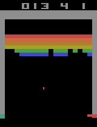

# Reinforcement Learning Use Cases

## 🧠 Machine Learning project - M2 IKSEM

    AI agents trained with Reinforcement Learning algorithms to learn to play video games.

### [Super Mario Bros](./super-mario-bros/)

<<<<<<< HEAD

### [Robotics](./robotic/)

    

### [Breakout](./breakout/)

### [SnakeGame](./SnakeGame/)

    

=======

>>>>>>> super-mario-bros
